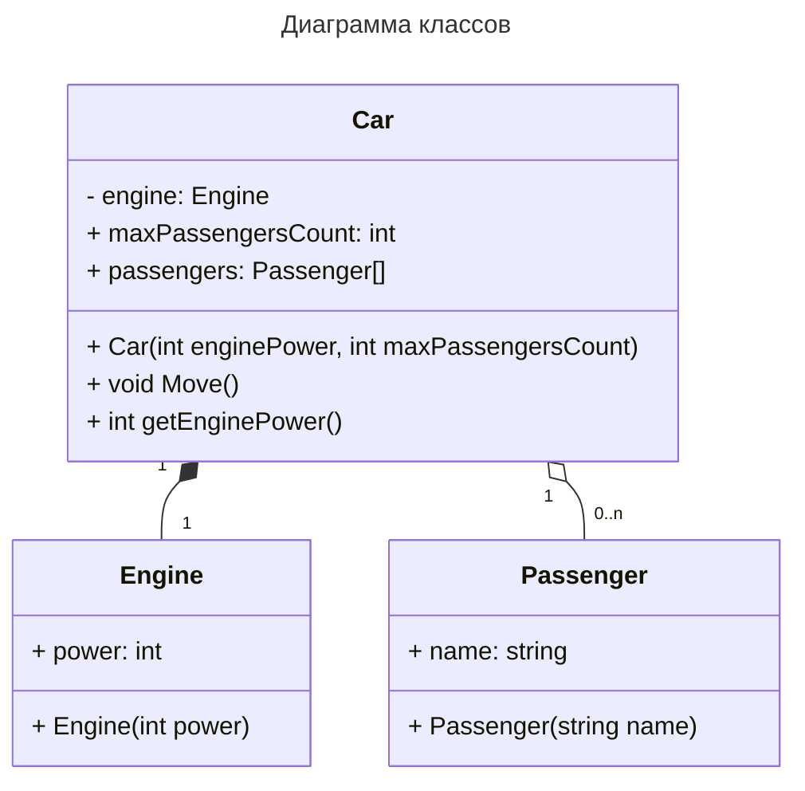

# C\#
#### 1. С#. Платформа .NET. Процесс выполнения программы.
**.NET** - это кроссплатформенный фреймворк от компании Microsoft, ранее известная как .NET Framework, когда она ещё была ориентированно только на ОС Windows. Она поддерживает множество языков, главный из которых **C#**, разработанный специально для неё.
Для выполнения кода в .NET служит **CLR** (Common Language Runtime, общеязыковая исполняющая среда). Она выполняет **CIL** (Common Intermediate Language, байт-код) - специальный промежуточный язык, который представляет собой "высокоуровневый ассемблер" виртуальной машины .NET. В него компилируются программы, написанные на .NET совместимых языках, получаются исполняемые файлы в формате `exe` или `dll`. При выполнение программы происходит преобразование CIL кода в машинный код, так называемая **Just-In-Time (JIT)** компиляция. Производительность повышается за счёт того, что во время выполнения компилируется лишь часть кода, к которой происходит обращение.
#### 2. С#. Структура программы. Пространство имен. Сборка.
##### Структура программы
Базовая структура программы на языке C# включает в себя главный класс и статическую функцию **`Main`**, принимающую в качестве параметра массив аргументов командной строки:
```cs
using System;
namespace program
{
    class Program
    {
        public static void Main(string[] argc)
        {
            
        }
    }
}
```
В новых версия появилась поддержка операторов верхнего уровня, что позволяет писать код программы не в функции `Main`, а сразу в файле, главный класс и функция `Main` тогда создаются автоматически.
Также каждый проект включает файл проекта с расширением **.csproj**, который содержит описание свойств проекта.
##### Пространства имён
Пространства имён (в примере выше - `program`) используются для объединения кода в логические блоки и предотвращения конфликтов имён. Пространство имён объявляется с помощью специального ключевого слова и последующего блока кода: `namespace <имя> { ... }`. Обращаться к членам пространства имён можно с помощью оператора точки: в примере выше полное имя функции `Main` будет `program.Program.Main`. Чтобы не обращаться к объектам по полному имени, можно подключить пространство имён с помощью директивы `using`. В примере выше так подключается пространство имён `System`. Пространства имён допускают вложенность. Можно объявить пространство имён для всего файла, добавив в начале: `namespace <имя>;`, оно применится к нему целиком.
##### Сборка
Сборка - это файл, который содержит программу или библиотеку кода, элементы управления, ресурсы или другую информацию, которая может быть использованы программой. Сборка создается как единый проект и компилируется в исполняемый файл (`exe`) или динамическую связанную библиотеку (`dll`).  Каждая сборка включает в себя манифест, метаданные типов, код приложения и ресурсы. Атрибуты сборки, такие как версия, название, автор и прочая информация о продукте, содержатся в специальном файле `AssemblyInfo.cs`.
#### 3. С#. Типы данных. Различия типов-значений и типов-ссылок.
Базовые типы в языке C#:
- **bool** - хранит значение `true` или `false`, представлен системным типом `System.Boolean`
- **byte** - хранит целое число от 0 до 255, системный тип - `System.Byte`
- **sbyte** - знаковый байт, целое число от -128 до 127, системный тип - `System.SByte`
- **short** - знаковое целое число от -32768 до 32767, занимает 2 байта, системный тип - `System.Int16`
- **ushort** - беззнаковое целое число от 0 до 65535, 2 байта, системный тип - `System.UInt16`
- **int** - знаковое целое число от -2147483648 до 2147483647, занимает 4 байта, системный тип - `System.Int32`, тип по умолчанию для численных литералов
- **uint** - беззнаковое целое число от 0 до 4294967295, занимает 4 байта, системный тип - `System.UInt32`
- **long** - знаковое целое число от –9223372036854775808 до 9223372036854775807, 8 байт, системный тип - `System.Int64`
- **ulong** - беззнаковое целое число от 0 до 18446744073709551615, 8 байт, системный тип - `System.UInt64`
- **float** - число с плавающей точкой от $-3.4 \cdot 10^{38}$ до $3.4 \cdot 10^{38}$, 4 байта, системный тип - `System.Single`
- **double** - число с плавающей точкой от $\pm 5.0 \cdot 10^{324}$ до $\pm 1.7\cdot10^{308}$, 8 байт, системный тип - `System.Double`
- **decimal** - десятичное дробное число, без десятичной запятой имеет значение от $\pm 1.0 \cdot 10^{-28}$ до $\pm 7.9228 \cdot 10^{28}$, 16 байт, системный тип `System.Decimal`
- **char** - одиночный символ в кодировке Unicode, 2 байта, системный тип - `System.Char`, тип по умолчанию для символьных литералов
- **string** - набор символов Unicode, системный тип - `System.String`, тип по умолчанию для строковых литералов
- **object** - может хранить значения любого типа данных, занимает 4 байта на 32-разрядной системе и 8 на 64-разрядной, системный тип - `System.Object`, являющийся базовым для всех других типов и классов .NET.

В C# возможна неявная типизация с использованием ключевого слова `var` (аналог `auto` в C++):
```cs
// можно писать так:
var hello = "hello world";
var a = 1;
var b = 12.345;
var c = 'A';
// но так нельзя!
var n = null;
```
Все типы данных подразделяются на типы-значения и типы-ссылки в зависимости от того, как для них происходит организация памяти. Память подразделяется на стек и кучу.
- Объекты типов-значений размещаются в стеке, по адресу непосредственно хранится само значение переменной или параметра функции. К таким типам относятся все целочисленные типы, типы чисел с плавающей запятой, типы `decimal`, `bool`, `char`, перечисления `enum` и структуры `struct`. (но поля типов-значений объектов располагаются в куче)
- Объекты ссылочных типов хранятся в куче, в стеке на них хранится лишь ссылка. Ссылочными типами являются `object`, `string`, все классы, интерфейсы и делегаты.

Процесс копирования разных типов различается: типы-значения копируются по значению, а для типов-ссылок копируется лишь ссылка на объект, то есть 2 ссылки начинают указывать на одну и ту же область в памяти. Это также относится к более сложным ситуациям, когда структура содержит поле с типом класса и при копировании этой структуры, получится, что все поля с типами-значениями скопировались по значению, а это поле класса по ссылке, то есть 2 разных объекта будут иметь поля с ссылкой на один и тот же объект. Таким образом, ссылки работают как указатели и дают те же возможности.
Стоит учитывать, что при передаче объекта класса в функцию через параметры, передаётся копия ссылки на исходный объект, то есть функция получает к нему доступ и может изменить его поля. При этом функция не может изменить сам объект, так как передана лишь копия ссылки. Чтобы это сделать, нужно использовать ключевое слово `ref`, тогда станет возможно, например, создание нового другого объекта и сохранение его по исходной ссылке.
#### 4. С#. Литералы. Примеры. Переменные. Примеры. Область действия переменной.
##### Литералы
Литералы (константы) - неизменяемые значения. Их можно передавать переменным в качестве значения. Виды литералов в C#:
- логические литералы: `true` и `false`
- целочисленные литералы:
	- в десятичной форме: `1`, `-2`, `123`
	- в двоичной форме: `0b11`, `0b1011`, `0b100001`
	- в шестнадцатеричной форме: `0x0A`, `0xFF`, `0xA1`
- вещественные литералы:
	- в десятичной форме: `12.34`, `-0.28`
	- в экспоненциальной форме: `3.2e3` ( $3.2 \cdot 10^3 = 3200$), `1.2E-1`
- символьные литералы: `'A'`, `'\n'`, `'\x75'`, `'\u0420'`
- строковые литералы: `"hello world"`
- `null` - ссылка, которая не указывает ни на какой объект
##### Переменные
Для хранения данных в программе применяются переменные. Переменная представляет именованную область памяти, в которой хранится значение определенного типа. Переменная имеет тип, имя и значение. Тип определяет, какого рода информацию может хранить переменная. Чтобы объявить переменную, нужно указать её тип и имя, например, переменная целого типа с именем `a`: `int a;`, строка `str`: `string str;`
Имя переменной может содержать любые цифры, буквы и символ подчёркивания, при этом первый символ должен быть буквой или подчёркиванием. В нём не должно быть пробелов и знаков пунктуации и оно не должно являться ключевым словом.
Чтобы инициализировать переменную, ей нужно присвоить значение:
```cs
int a; // объявляем переменную целого типа
a = 5; // присваиваем значение
char c = 'a'; // можно объявить переменную и сразу же инициализировать её
string name = "Max";
```
Для переменных существует модификатор `const`, который запрещает изменение значения после инициализации (она при этом обязательна при объявлении переменной):
```cs
// константы принято называть большими буквами
const int SIZE = 10; // объявление константы с значением 10
SIZE = 5; // ошибка!!! константы нельзя изменить
```
##### Области действия (видимости) переменных
Каждая переменная существует только в определённом контексте:
- Контекст класса - переменные, объявленные на уровне класса, доступны во всех его методах, их называют глобальными или полями класса.
- Контекст метода - переменные, объявленные на уровне метода, являются локальными и доступны только в рамках этого метода.
- Контекст блока кода - переменные, объявленные на уровне блока кода, также являются локальными и доступны только в этом блоке кода.
```cs
class Obj
{
	int n = 10; // переменная уровня класса
	// в этом месте досутпна только переменная n
	public void Print()
	{
		char c = 'A'; // локальная переменная метода
		// в этом месте доступны переменные n и c
		{ // блок кода
			string str = "hello"; // локальная переменная блока кода
			// здесь доступны все 3 переменные: n, c и str
		}
	}
	public void Save()
	{
		// здесь доступно только поле класса n
	}
}
```
#### 5. С#. Выражения. Преобразование типов при выполнении операций. Примеры.
Выражение - правило вычисления значения. Состоит из операндов (переменные, литералы и поименованные константы) и операций. По приоритету:
	1. Первичные: `.`, `()`,  `[]`, `x++`, `x--`, `new`, `typeof`, `checked`, `unchecked`
	2. Унарные: `+`, `-`, `!`, `~`, `++x`, `--x`, `(<Тип>)`
	3. Мультипликативные: `*`, `/`, `%`
	4. Аддитивные: `+`, `-`
	5. Сдвига: `<<`, `>>`
	6. Отношения порядка и проверки типа: `<`, `>`, `<=`, `>=`, `is`, `as`
	7. Проверка на равенство: `==`, `!=`
	8. Поразрядные логические: `&`, `^`, `|`
	9. Условные логические: `&&`, `||`
	10. Условная операция: `? :`
	11. Присваивания: `=`, `*=`, `/=`, `%=`, `+=`, `-=`, `<<=`, `>>=`, `&=`, `^=`, `|=`

Если операнды, участвующие в операции имеют разные типы, то неявно выполняются преобразования типов, исключающие потерю данных, то есть к более длинным типам и от целых чисел к вещественным: `char -> int -> long -> float -> double`. Преобразования, которые могут приводить к потере данных, например, вещественных чисел в целые, требуют явного преобразования типов. Явное преобразование можно выполнить:
- с помощью операции `(<типа>) <имя переменной>`:
```cs
int k = 100;
char c = (char)k;
long b = 300;
int a = (int)b;
byte d = (byte)a; // произойдёт потеря данных
```
- соответствующим методом класса `Convert`:
```cs
int i = Convert.ToInt32("123");
bool b = true;
double d = Convert.ToDouble(b);
```
Если преобразование невозможно, то генерируется исключение `FormatException`
#### 6. С#. Ввод-вывод консольного приложения. Примеры.
##### Вывод
Для выполнения операций вывода используют статические методы класса `System.Console`, перегруженные для всех стандартных типов данных и форматного вывода:
- `Console.Write()` – вывод строки без перехода на следующую;
- `Console.WriteLine()` – вывод строки с переходом на следующую.
```cs
Console.Write("Целое число: ");
Console.WriteLine(123);
```
Эти функции принимают строку и список аргументов для форматирования. Синтаксис форматирования: `{<номер аргумента>[, <мин. ширина поля>][:(<спецификатор формата[<число>]> | <шаблон>)]}`
```cs
Console.WriteLine("Имя: {0}, возраст: {1}, рост: {2}", "Петя", 14, 170);
```
Спецификаторы форматирования:
- `C` или `c` - форматирование как национальной валюты
- `F` или `f` - форматирование как число с фиксированной точкой, можно указать число знаков после запятой
- `G` или `g` - форматирование в общем виде
- `P` или `p` - форматирование как процента
- `X` или `x` - форматирование как шестнадцатеричного числа
```cs
Console.WriteLine("{0:C}", 10);
Console.WriteLine("{0:F2}", 10); // 2 знака после запятой
Console.WriteLine("{0:G}", 12.234M); // Decimal
Console.WriteLine("{0:P}", 0.97); // 97,00 %
Console.WriteLine("{0:X}", 12754); // 31D2
```
Шаблоны форматирования:
- `#` - вставка значащей цифры
- `0` - вставка значащей цифры или незначащего нуля
```cs
Console.WriteLine("{0,7:000.###}", 12.345); // 012.345
```
Возможна интерполяция строк, в которую можно вставлять интерполированные выражения: `{<выражение>[, <длина>]][:<формат>]}`. Длина - константа, если она отрицательная, используется выравнивание по левому краю. Интерполированная строка обозначается знаком `$"..."`
```cs
Console.WriteLine($"Результат: {Res}");
Console.WriteLine($"|{"Left",-7}|{"Right",7}|");
Console.WriteLine($"{Math.PI,10:F5}");
```
##### Ввод
Для выполнения операций вывода используют статические методы класса `System.Console`:
- `Console.ReadLine()` - ввод строки типа `string`, включая перенос строки 
- `Console.Read()` - возвращает код введённого символа типа `int` или `-1`, если значащих символов в потоке нет
```cs
string s = Console.ReadLine();
char ch = (char)Console.Read();
Console.Readkey(); // ввод символа или функциональной клавиши
```
Преобразование введённой строки в число осуществляют:
- методы класса `Convert`, возвращающие `FormatException` в случае ошибки
- методы `Parse` каждого числового класса, возвращающие `FormatException` в случае ошибки
- методы `TryParse`, при ошибке возвращающие `false` в случае ошибки
```cs
int a = Convert.ToInt32("123");
int b = int.Parse("123");
double c = int.Parse("12.345"); // разделитель определяется операционной системой
int d;
bool res = int.TryParse("123", out d);
```
#### 7. С#. Исключения. Примеры.
Исключения - это аварийные ситуации, возникающие в процессе выполнения программы, например, деление на 0, переполнение, невозможность преобразования строки в число и т.д.
C# позволяет обрабатывать синхронные исключения, которые могут возникнуть в конкретных местах программы, когда какая-либо её часть не смогла выполнить то, что от неё требовалось. Они генерируются средой выполнения или предусматриваются программистом в опасных местах с помощью оператора `throw`. Классы исключений в C# организованы в иерархию, обработчики родительских классов перехватывают исключения всех производных классов. Собственные классы исключений следует наследовать от класса `ApplicationException`.
Для перехвата и обработки исключений используется конструкция `try ... catch`:
```cs
try <Оператор>
catch ([<Тип исключения> [<Имя>]]) <Оператор>
{catch ([<Тип исключения> [<Имя>]]) <Оператор>}
[finally <Оператор>]
```
- `catch(<Тип>)` - перехватывает все исключения заданного и производных классов
- `catch(<Тип> <Имя>)` - то же самое, но позволяет передать объект исключения в обработчик как параметр
- `catch` - обрабатывает любые исключения
- `finally` - выполняется, если в блоке `try` не возникло исключений

Пример:
```cs
int[] nums = { 1, 2, 3, 4, 5, 6, 7};
Console.Write("Введите индекс от 0 до 6: ");
try {
    int i = int.Parse(Console.ReadLine());
    Console.WriteLine(nums[i]);
} catch (IndexOutOfRangeException) {
    Console.WriteLine("Неверный индекс!");
} catch (FormatException) {
    Console.WriteLine("Введено не число!");
} catch {
    Console.WriteLine("Неизвестная ошибка");
} finally {
    Console.WriteLine("Ошибок не возникло");
}
```
Класс `Exception` содержит полезные свойства:
- `Message` - текстовое описание ошибки
- `Source` - имя объекта, сгенерировавшего ошибку
- `TargetSite` - метод, сгенерировавший ошибку
- `InnerException` - ссылка на исключение, послужившее причиной текущего

Для генерации ошибки используется оператор `throw <Выражение>;`. Форма без параметра используется для возобновления исключения.
```cs
throw new DivideByZeroException(); // генерация исключения
...
throw; // возобновление исключения
```
Операторы `checked` и `unchecked` используются для включения и отключения проверки числовой арифметики на исключения:
```cs
// вариант checked для одного выражения
checked(a + b); // если произойдёт переполнение, будет выброшено исключение OverflowException
checked {
	byte a = 255;
	++a; // будет выброшено исключение из-за переполнения типа byte
}
// в таком случае его нужно обработать
checked // вариант checked для блока кода
{
    byte a = 255; // максимальное значение для типа byte
    try
    {
        ++a;
    }
    catch (OverflowException)
    {
        Console.WriteLine("Произошло переполнение");
    }
}
```
Оператор `unchecked` наоборот отключает эту проверку и допускает переполнения.
#### 8. С#. Объявление классов и их компонентов. Примеры.
Классы в языке C# описываются в привычном виде: `[Атрибуты][Спецификаторы] class <Имя>[: Предки] { Тело класса}`.
Компонентами класса могут быть поля и методы:
- поля - хранят данные:
	- константы - общие для всех объектов
	- переменные:
		- поля объекта - свои для каждого объекта
		- поля класса (статические поля) - общие для всех объектов
- методы - процедуры и функции, обрабатывающие данные

Пример:
```cs
// абстрактный класс, доступный в данной сборке
internal abstract class A {
    public int x; // переменная-поле объекта
    protected static int y; // статическая переменная
    public A(int _x, int _y) {
        x = _x;
        y = _y;
    }
    public void print() // метода класса
    {
        Console.WriteLine("x = {0}, y = {1}", x, y);
    }
}
// класс, наследуемый от класса A, доступный в данной сборке и не допускающий наследование от себя самого
internal sealed class B : A {
    const double eps = 1e-10; // константа
    public B(int _x=0, int _y=0) : base(_x, _y) { } // вызов конструктора базового класса
    new public void print() // перемеопределение метода с помощью спецификатора new
    {
        Console.WriteLine("x = {0}, y = {1}, eps = {2}", x, y, eps);
    }
}
```
Объявление класса по сути является созданием собственного типа, объект класса может быть создан c помощью ключевого слова `new`:
```cs
B b = new B(1, 2);
```
#### 9. С#. Спецификаторы доступа классов, структур и их компонентов.
Эти спецификаторы доступны и одинаково работают как для классов, так и для полей и методов (за исключением включающих `protected` для структур, так как они не допускают наследование):
- `public` - доступ не ограничен
- `protected` - доступ из производных классов
- `private` - доступ только из данного класса (по умолчанию для вложенных классов и полей класса)
- `internal` - доступ из классов сборки (по умолчанию для всех классов, кроме вложенных)
- `protected internal` - доступ из производных классов этой и других сборок, а также классов данной сборки
- `private protected` - доступ из производных классов данной сборки

Для классов также:
- `abstract` - абстрактный класс
- `static` - статический класс (содержит только статические компоненты, объекты создавать запрещено)
- `new` - для вложенных классов задаёт новое описание класса взамен унаследованного
- `sealed` - запрещает наследование от данного класса

Для полей доступны дополнительно:
- `const` - делает поле неизменяемым, такие поля требуют инициализации при компиляции и общие для всех членов класса, возможно обращение через имя класса
- `readonly` - доступ только для чтения, инициализируются при компиляции или конструктором
- `static` - статическое поле, общее для всех объектов, возможно обращение через имя класса
- `new` - задаёт новое описание поля, скрывающее унаследованное
- `volatile` - значение, которое может быть изменено другим процессом
```cs
class A
{
    private int i = 1;         // скрытое поле объекта
    double z;                // скрытое поле объекта (по умолчанию)
    public int v;                    // общедоступное поле объекта
    public const double w = 32.517;  // константное поле класса
    public static string s = "D";    // статическое поле класса
}
```
#### 10. C#. Конструкторы классов. Примеры.
Конструктор – метод, автоматически вызываемый для инициализации полей при создании объекта с помощью `new`.  Если явно конструктор не описан, то автоматически создается  пустой конструктор без параметров (называемый конструктором по умолчанию), который инициализирует поля-значения нулями, а поля ссылочного типа значением `null`.
Формат описания: `Имя_класса ([Параметры])[: Инициализатор] Блок_кода`
Конструктор не возвращает никакого значения(даже `void`), может быть несколько раз параметрически перегружен и автоматически вызывает конструктор базового класса, если он не вызван в инициализаторе. Конструктор базового класса можно вызвать явно: `base(<аргументы>)`
```cs
class Point {
    protected int x_, y_;
    public int x { get => x_; } // переменные x и y только для чтения для внешних объектов
    public int y { get => y_; }
    public Point() {} // конструктор по умолчанию, инициализирует поля 0
    public Point(int x, int y) // конструктор с 2 параметрами
    {
        x_ = x;
        y_ = y;
    }
}
class Dot : Point // наследование от класса Point
{
    protected int radius_;
    public int R { get => radius_; }
    // конструктор базового класса здесь можно не вызывать, без параметров он будет вызван автоматически
    public Dot() { }
    // вызываем конструктор базового класса с параметрами для инициализации всех полей
    public Dot(int radius, int x, int y) : base(x, y) {
        radius_ = radius;
    }
}
```
#### 11. C#. Поля: константные, объекта, класса, только для чтения. Примеры.
Формат описания полей в классе: `[Атрибуты] [Спецификаторы] Тип Имя[=Значение]`
Для полей доступны спецификаторы:
- `public` - доступ не ограничен
- `protected internal` - доступ из методов данного и производных классов, а также других классов данной сборки
- `internal` - доступ из методов классов данной сборки
- `protected` - доступ из методов данного и производных классов
- `private protected` - доступ из методов данного и производных классов данной сборки
- `private` - доступ из методов данного класса (по умолчанию)
- `const` - неизменяемое значение, инициализация при компиляции, общее для всех объектов, доступно обращение через имя класса
- `readonly` - доступ только для чтения, инициализируется при компиляции или в конструкторе
- `static` - общее значение для всех экземпляров класса, обращение через имя класса
- `new` - скрывает унаследованное описание поля и задаёт новое
- `volatile` - значение может быть изменено другим процессом
```cs
namespace n
{
    class A
    {
        private int i = 1;                // скрытое поле объекта
        double z;                        // скрытое поле объекта
        public int v;                    // общедоступное поле объекта
        public const double w = 32.517;  // константное поле класса
        public static string s = "D";    // статическое поле класса
    }
    class Program
    {
        public static void Main()
        {
            A a = new A();            // создание объекта
            Console.WriteLine(a.v);   // доступ через имя объекта
            Console.WriteLine(A.w);   // доступ через имя класса
            Console.WriteLine(A.s);   // доступ через имя класса
         // Console.WriteLine(a.z);   // ошибка, доступ невозможен!
        }
    }
}
```
#### 12. C#. Методы: конструкторы объектов, статические, деструкторы. Примеры.
Конструкторы - определяют действия по инициализации объектов:
- конструкторы объектов;
- статические конструкторы - для инициализации статических полей - вызывается неявно один раз до 1-го обращения к полям и методам класса.
Деструкторы – определяют действия, которые должны быть выполнены перед уничтожением объектов.
Статические методы общие для всех объектов класса и вызываются через имя класса. Также называются методами класса, в то время как обычные методы - методами объектов.
```cs
namespace ns
{
    class Program
    {
        public static void Main()
        {
            Console.WriteLine(Point.getCount()); // 0
            Point a = new Point();
            Point b = new Point(1, 2);
            Console.WriteLine(Point.getCount()); // 2
        }
    }
    class Point
    {
        private int x_, y_;
        private static int count; // статическая переменная для подсчёта объектов
        public int x { get => x_; }
        public int y { get => y_; }
        public Point() // в конструкторах увеличиваем счётчик
        {
            count++;
        }
        public Point(int x, int y)
        {
            x_ = x;
            y_ = y;
            count++;
        }
        public static int getCount() // статический метод для получения числа существующих объектов
        {
            return count;
        }
        ~Point() // деструктор
        {
            count--; // уменьшаем счётчик объектов
        }
    }
}
```
#### 13. C#. Методы: объектов, классов. Примеры.
Статические методы называются методами класса, потому что не привязаны к конкретному объекты и могут быть вызваны через имя класса без создания объекта. Они также не получают параметра `this`. Примеры таких методов: `Console.WriteLine(), Console.Write(), int.TryParse()`
Методы классов - это нестатические методы класса, вызываемые для объектов и зависящие от них. Для вызова такого метода сначала нужно создать объект класса.
```cs
namespace ns
{
    class Program
    {
        public static void Main()
        {
            Point p1 = new Point(1, 1);
            Point p2 = new Point(4, 5);
            // вызов методов объектов
            p1.Print();
            p2.Print();
            // вызов статического метода класса через имя класса
            Console.WriteLine("Distance: {0}", Point.distance(p1, p2));
        }
    }
    class Point
    {
        private int x_, y_;
        public int x { get => x_; }
        public int y { get => y_; }
        public Point(int x, int y)
        {
            x_ = x;
            y_ = y;
        }
        // метода объекта
        public void Print()
        {
	        // this.x - можно получить доступ и так
            Console.WriteLine($"Point: ({x}, {y})");
        }
	    // статический метода класса
        public static double distance(Point p1, Point p2)
        {
	        // this.x - ошибка
            return Math.Sqrt(Math.Pow(p1.x - p2.x, 2) + Math.Pow(p1.y - p2.y, 2));
        }
    }
}
```
#### 14. C#. Параметры методов. Передача параметров по значению и по ссылке. Выходные параметры. Примеры.
Используется 4 типа параметров:
- **параметры-значения**, описанные без указания ключевого слова, в стеке создаётся копия этого значения, для типа-значения - само значение, для типа-ссылки - копия ссылки на тот же объект (возможна работа с объектом, но не изменение его на другой)
```cs
namespace ns
{
    class Program
    {
        public static void Main()
        {
            int a = 10;
            change(a);
            Console.WriteLine($"In Main: {a}");// исходная переменная не изменилась
            string s = "abc";
            replace(s);
            Console.WriteLine($"In Main: {s}"); // исходная строка не изменилась
        }
        // значение копируется
        public static void change(int a)
        {
            a = 1;
            // изменилась локальная переменная
            Console.WriteLine($"Inside \"change\": {a}");
        }
        // ссылка копируется
        public static void replace(string s)
        {
            s = s.Replace("ab", "ba");
            // локальная переменная внутри метода указывает на новый объект
            Console.WriteLine($"Inside \"replace\": {s}");
        }
    }
}

```
- **параметры-ссылки**, описанные `ref`, метод получается ссылку на исходный объект (может изменить исходное значение для типа-значения или ссылку для ссылочного типа)
```cs
namespace ns
{
    class Program
    {
        public static void Main()
        {
            string s = "abc";
            Console.WriteLine(s); // исходная строка
            replace(ref s); // передача ссылки
            Console.WriteLine(s); // новая строка
        }
        // передаётся ссылка на исходную ссылку
        public static void replace(ref string s) // параметр-ссылка
        {
            // вместо исходной ссылки из метода Main записывается новая
            s = s.Replace("ab", "ba");
        }
    }
}
```
- **выходные параметры**, описанные `out`, используются для возврата значения из метода через параметры, в теле метода обязательно нужно присвоить значение этому параметру
```cs
namespace ns
{
    class Program
    {
        public static void Main()
        {
            int a = 2;
            int b = 3;
            int S;
            // выходные параметры передаются с ключевым словом out и допускают одновременное объявление переменной
            calculateRectangle(a, b, out S, out int P);
            // результат вычислений доступен в S и P
            Console.WriteLine($"a = {a}, b = {b}, S = {S}, P = {P}");
        }
        // метод имеет выходные параметры S и P
        public static void calculateRectangle(int a, int b, out int S, out int P) 
        {
            // присваиваем значения как переменным
            S = a * b;
            P = (a + b) * 2;
        }
    }
}
```
- **параметры-массивы**, описанные `params` – используются при переменном количестве параметров, объявляется последним, используется, когда количество параметров заранее неизвестно
```cs
namespace ns
{
    class Program
    {
        public static void Main()
        {
            // можно вызвать с любым количеством параметров
            printNumbers(1, 2, 3, 4, 5, 6, 7);
            printNumbers(1, 2, 3);
        }

        public static void printNumbers(params int[] numbers)
        {
            // размер массив получаем через свойство Length
            Console.WriteLine("Передано чисел: {0}", numbers.Length);
            // работаем как с обычным массивом
            foreach(int i in numbers)
                Console.Write("{0} ", i);
            Console.WriteLine();
        }
    }
}
```

Переданные (фактические) параметры должны соответствовать объявленным (формальным) по количеству, порядку и типу (либо существовать преобразование).
Возможно задание параметров по умолчанию и именование при передаче аргументов.
```cs
namespace ns
{
    class Program
    {
        public static void Main()
        {
            PrintInfo("Tom", 18); // можно не передавать параметр height
            PrintInfo("John", height: 190); // передача роста через поименованные параметры

        }
        // для параметров age и height установлены значения по умолчанию
        public static void PrintInfo(string name, int age=20, double height=180)
        {
            Console.WriteLine($"Имя: {name}, Возраст: {age}, Рост: {height}");
        }
    }
}
```
#### 15. C#. Одномерные массивы c элементами типов-значений и ссылочных типов. Примеры объявления.
Массив любых данных представляет собой указатель на область памяти, в которую эти данные записаны:
- для типов-значений по этому адресу хранятся последовательно записанные значения
- для типов-ссылок - последовательно записанные ссылки на объекты, которые сами могут быть разбросаны по памяти в любом порядке

Синтаксис объявления одномерного массива: `Тип_элемента [] Имя [= [new Тип_элемента[[Размерность]]]{Список_инициализаторов}];`
Примеры объявления массивов для типов-значений:
```cs
int[] a; // без выделения памяти по элементы
int[] b = new int[5]; // массив из 5 элементов типа int, инициализация нулями
int[] c = { 1, 2 }; // инициализация 2 элеменами
int[] d = new int[] { 1, 2 };
int[] e = new int[2] { 1, 2 };
```
Для ссылочных типов для каждого элемента нужно отдельно  создавать объект:
```cs
string[] m = new string[2]; // массив из 2 элементов
// создаём объекты
m[0] = new string("Hello");
m[1] = new string("world");

string[] s = { new string("Hello"), new string("world") };
```
#### 16. C#. Оператор foreach. Примеры применения для массивов разных типов.
Оператор `foreach` осуществляет последовательное чтение элементов коллекции (массива, строки и т.д.). Синтаксис:
```cs
foreach (тип Имя in Коллекция) Тело
```
##### Примеры:
Вывод элементов одномерного массива:
```cs
int[] a = { 1, 2, 3, 4, 5 };
foreach (int i in a)
	Console.WriteLine(i);
```
Вывод элементов ступенчатого массива:
```cs
char[][] c = new char[3][];
c[0] = new char[] { 'a', 'b', 'c' };
c[1] = new char[] { 'q' };
c[2] = new char[] { 'h', 'e', 'l', 'l', 'o' };
foreach (char[] l in c)
{
	foreach (char i in l)
		Console.Write("{0, 2}", i);
	Console.WriteLine();
}
```
#### 17. C#. Массивы прямоугольные и ступенчатые. Различие. Примеры
Синтаксис объявления двумерных (прямоугольных) массивов:
```cs
Тип_элемента[,] Имя [= [new Тип_элемента]
					 [[Размерность1], [Размерность2]]
					{
						 {Список_инициализаторов},
						 {{Список_инициализаторов}}
					}];
```
Примеры объявления:
```cs
int[,] m1 = new int[2,3]; // инициализация нулями
int[,] m2 = new int[2, 3] {
	{ 1, 2, 3 },
	{ 4, 5, 6 }
}; // инициализация значениями
int[,] m3 = new int[] { { 1, 2, 3 }, { 4, 5, 6 } };
int[,] m4 = { { 1, 2, 3 }, { 4, 5, 6 } };

Console.WriteLine(m2[1, 2]); // доступ к элементам
foreach (var i in m2) // возможен обход циклом foreach, но неудобен из-за индексации
	Console.Write("{0} ", i); // 1 2 3 4 5 6
```
Ступенчатые массивы представляют собой массивы массивов, что и позволяет делать их ступенчатыми. Синтаксис объявления ступенчатого массива:
```cs
Тип_элемента[][] Имя = new  Тип_элемента [Размерность1][];
// инициализация каждого подмассива отдельно
Имя[0] = new int[Размерность2];
{Имя[1] = new int[Размерность2];}
// или сразу
Тип_элемента[][] Имя = {
	new Тип_элемента[Размерность][],
	{new Тип_элемента[Размерность][],}
};
```
Примеры:
```cs
int[][] a = new int[2][];
a[0] = new int[3] { 1, 2, 3 };
a[1] = new int[2] { 4, 5 };

int[][] b = { new int[] { 1, 2, 3 }, new int[] { 4, 5 } };
// обращение к элементу
a[0][1];
```
##### Различие между двумерными и ступенчатыми массивами
Данные в памяти хранятся по-разному, что отражается в синтаксисе.
- В случае двумерного массива хранится адрес области в памяти фиксированного размера, в которую последовательно записаны элементы массива.
- В случае ступенчатого массива в область памяти по адресу записаны последовательно адреса памяти каждого подмассива, которые в свою очередь разбросаны по памяти (но в каждом отдельном данные записаны последовательно), что и позволяет получать подмассивы разного размера.
#### 18. C#. Строка String. Примеры создания и использования.
Строки на основе класса `System.String` - неизменяемый ссылочный тип данных.
```cs
// объявление строки без инициализацит
string s1;
string s2 = null;
// пустая строка ""
string emptry = System.String.Empty;
// инициализация литералом
string str = "Hello world";
// создание строки через конструктор
string s3 = new string('a', 10); // строка из 10 символов 'a'
char[] char_arr = new char[] { 'a', 'b', 'c' };
string s4 = new string(char_arr);
```
Операции над строками:
```cs
string str1 = "abc";
string str2 = "def";
string concat = str1 + str2; // концатенация строк: "abc" + "def" = "abcdef"
bool isEqual  = (str1 == str2); // посимвольное сравнение строк
if (str1 != concat) // сравнение на неравенство "! ="
	Console.WriteLine("str1 != concat");
Console.WriteLine("str[1] = {0}", str1[1]); // обращение к символу по индексу
```
Нужно быть осторожными с присваиванием ссылки на строку другой переменной. Строки неизменяемы, поэтому строка по ссылке не изменится, поменяется сама ссылка.
```cs
string str1 = "abc";
string str2 = str1;
str1 += "def";
Console.WriteLine("str1 = \"{0}\"", str1); // str1 = "abcdef"
Console.WriteLine("str2 = \"{0}\"", str2); // str2 = "abc"
```
#### 19. C#. Регулярные выражения. Примеры.
Регулярные выражения (**regular expressions**) - шаблоны, по которым можно выполнять поиск и редактирование фрагментов текста.
Язык описания регулярных выражений содержит символы двух видов:
- обычные символы, представляющие в выражение сами себя
- метасимволы:
	- обозначающие классы символов (любая буква - `\w`, любая цифра - `\d`)
	- уточняющие символы (`^`, `$`)
	- квантификаторы (повторители) (`+`, `{3}`)
###### Классы символов:
- `.` - любой символ, кроме `\n`
- `[]` - любой одиночный символ из последовательности внутри скобок
- `[^]` - любой одиночный символ, не входящий в последовательность внутри скобок
- `\w` - любой алфавитно-цифровой символ (буква или цифра)
- `\W` - любое не алфавитно-цифровой символ (не буква и не цифра)
- `\s` - любой пробельный символ, пробел, табуляция (`\t`), перевод строки (`\n`, `\r`), новая страница (`\f`)
- `\S` - любой не пробельный символ
- `\d` - любая десятичная цифра
- `\D` - любой символ, не являющийся цифрой
###### Уточняющие символы:
- `^` - поиск только в начале строки
- `$` - поиск только в конце строки
- `\b` - начинается или заканчивается только на границе слова (между `\w` и `\W`)
- \B - не должен встречаться на границе слова
###### Повторители:
- `*` - 0 или более повторений предыдущего символа
- `+` - 1 или более повторений предыдущего символа
- `?` - 0 и 1 повторение предыдущего символа
- `{n}` - ровно `n` повторений предыдущего символа
- `{n,}` - не менее `n` повторений предыдущего символа
- `{n,m}` - от `n` до `m` повторений предыдущего символа

Для задания повторения последовательности применяется группирование с помощью круглых скобок.
###### Примеры:
- `[+-]?\d+` - целое число со знаком: 10, -123
- `[-+]?\d+\.?\d*` - вещественное число (со знаком и дробной частью): -456.78
- `^[А-Я]{1}\d{3}[А-Я]{2}$` - номер автомобиля
- `(\d{1,3}\.){3}\d{1,3}` - IP-адрес (не точно)
- `\w+\@\w+\.\w{2,4}` - email адрес
##### Работа с регулярными выражениями в C\#
В C# можно использовать регулярные выражения 2 способами:
- через статические методы класса `Regex` (`System.Text.RegularExpressions`)
- с помощью создания объекта класса `Regex` и инициализации его регулярным выражением

Методы:
- `IsMatch()` - проверяет, встречается ли в тексте шаблон
- `Match()`, `Matches()` - извлекают одно или все вхождения шаблона в виде объектов `Match`
	- объект `Match` имеет поля `Value` (найденный фрагмент текста) и `Index` (позиция, на которой он встречается), а также метод `NextMatch()` для перехода к следующему вхождению
- `Replace()` - заменяет соответствующий шаблон на заданный фрагмент текста
- `Split()` - разделяет текст на массив строк по заданному разделителю
#### 20. C#. Структуры. Примеры.
Структуры - это эффективный тип данных (не требующий динамической памяти), аналогичный классу, но являющийся типом-значением. Применяется для типов данных с небольшим количеством полей. Синтаксис объявления: `[Атрибуты][Спецификаторы] struct Имя: Интерфейсы Тело`. Тело структуры может состоять из констант, полей, методов, свойств, событий, индексаторов, операций, конструкторов и вложенных типов. Возможные спецификаторы:
- `public` - доступ не ограничен
- `internal` - доступ из классов и структур данной сборки (по умолчанию)
- `private` - для вложенных структур доступ из материнских класса или структуры (по умолчанию для вложенных структур)
- `new` - для вложенных структур задаёт новое описание структуры взамен унаследованного

Для структур применяется упаковка, когда требуется неявное преобразование в ссылочный тип, и распаковка, когда наоборот. Другие особенности структур:
- от структур невозможно наследование (не могут быть абстрактными, по умолчанию `sealed`, не могут иметь виртуальных методов), но они могут реализовывать интерфейсы
- в структуре нельзя инициализировать значения и определять конструктор по умолчанию, неявный обнуляет все поля
- в структуре нельзя определять деструктор
- параметр `this` для структуры - значение
```cs
namespace ns
{
    class Program
    {
        public static void Main(string[] args)
        {
            Complex a = new Complex(1.3, 2.6);
            Complex b = new Complex(6.4, 3.7);
            Complex z = a * b;
            Console.WriteLine(z);
        }
    }
    struct Complex {
	    // поля типа double
        public double re, im;
        // конструктор по умолчанию не нужен
        public Complex(double r, double i) {
            re = r;
            im = i;
        }
        // переопределение операторов сложения и умножения
        public static Complex operator+(Complex a, Complex b) {
            return new Complex(a.re + b.re, a.im + b.im);
        }
        public static Complex operator*(Complex a, Complex b) {
            return new Complex(a.re * b.re - a.im * b.im, a.im * b.re + a.re * b.im);
        }
        public override string ToString()
        {
            return string.Format("{0:0.##} + {1:0.##}i", re, im);
        }
    }
}
```
#### 21. C#. Наследование. Пример.
Синтаксис описания классов-потомков:
`[Атрибуты][Спецификаторы] class Имя [:Предки] Тело`
В качестве предков помимо **единственного** обычного класса могут выступать интерфейсы. Если предки не указаны, то предком по умолчанию является класс `Object`. Конструкторы не наследуются. Порядок вызова конструкторов при создании объекта:
1. При отсутствии вызова конструктора базового класса через `base` вызывается конструктор базового класса без параметров
2. Вызываются конструкторы полей-объектов
3. Вызывается конструктор производного класса

Любой компонент базового класса можно заменить с помощью `new`. Доступ к исходным компонентам базового класса можно получить с помощью обращения через `base`.
```cs
namespace ns
{
    class Program
    {
        public static void Main(string[] args)
        {
            Number n = new Number(1.23);
            Complex z = new Complex(2.34, 5.24);
            n.Print();
            z.Print();
        }
    }
    public class Number {
        public double num;
        public Number(double num_) {
            num = num_;
        }
        public void Print() {
            Console.WriteLine("{0:0.##}", num);
        }
    }
    class Complex : Number {
        public double im;
        // вызов конструктора базового класса
        public Complex(double re, double im_) : base(re) {
            im = im_;
        }
        // переопределение метода
        new public void Print() {
  	        // base.Print() - возможен вызов метода класса Number
            Console.WriteLine("{0:0.##} + {1:0.##}i", num, im);
        }
    }
}
```
#### 22. C#. Полиморфное наследование. Абстрактные классы. Пример.
##### Полиморфное наследование
Полиморфное наследование реализуется через таблицу виртуальных методов. Виртуальные методы описываются служебным словом `virtual`. Связь объекта реализуется скрытым кодом в конструкторе. Для переопределения виртуальных методов используется служебное слово `override`. Необходимость применения полиморфного наследования возникает часто, так как работа с объектами происходит через указатели и при обычном переопределении функции для объекта, сохранённого по указателю базового класса, будет вызван неправильный метод.
```cs
namespace ns
{
    class Program
    {
        public static void Main(string[] args)
        {
            Number n = new Number(1.23);
            Number z = new Complex(2.34, 5.24);
            n.Print();
            z.Print(); // вызван метода производного класса, указатель типа Number
        }
    }
    class Number {
        public double num;
        public Number(double num_) {
            num = num_;
        }
        // определяем виртуальный метод
        public virtual void Print() {
            Console.WriteLine("{0:0.##}", num);
        }
    }
    class Complex : Number {
        public double im;
        public Complex(double re, double im_) : base(re) {
            im = im_;
        }
        // переопределяем виртальный метод при наследовании
        public override void Print() {
            Console.WriteLine("{0:0.##} + {1:0.##}i", num, im);
        }
    }
}
```
##### Абстрактные классы и методы
Методы, не реализованные в классе, называются абстрактными, объявляются как `abstract`. Класс, содержащий абстрактные методы, называется абстрактным. Объекты такого класса создавать запрещено.
```cs
namespace ns
{
    class Program
    {
        public static void Main(string[] args)
        {
            Person person = new Person("John", 32);
            Animal animal = new Animal("Dog", 1);
            // создать объект абстрактного класса не получится
            // Creature creature = new Creature("Something", 0); - ошибка
            person.Print();
            person.Move();
            animal.Print();
            animal.Move();
        }
    }
    // абстрактный класс, содержащий абстрактные методы
    abstract class Creature
    {
        public string name { get; set; }
        public int age { get; set; }
        public Creature(string name_, int age_) {
            name = name_;
            age = age_;
        }
        // объявление абстрактных методов
        public abstract void Print();
        public abstract void Move();
    }
    class Person : Creature {
        public Person (string name, int age) : base(name, age) { }
        // переопределние абстрактных методов
        public override void Print() {
            Console.WriteLine("Person: name = {0}, age = {1}", name, age);
        }
        public override void Move() {
            Console.WriteLine("Person is moving...");
        }
    }
    class Animal : Creature {
        public Animal (string name, int age) : base(name, age) { }
        // переопределение абстрактных методов
        public override void Print() {
            Console.WriteLine("Animal: name = {0}, age = {1}", name, age);
        }
        public override void Move() {
            Console.WriteLine("Animal is moving...");
        }
    }
}
```
#### 23. C#. Композиция и агрегация. Пример.
Композиция и агрегация являются частными случаями ассоциации.
**Ассоциация** - объекты класса включаются в качестве полей в объекты другого класса. Бывают: двусторонние, односторонние, самоассоциации и многозначные ассоциации. Могут иметь название, например "владеет" ("**HAS A**"):
- Агрегация - объект класса-части включается в объект класса-целого и при отсутствии объектов класса-части объект класса-целого не теряет функциональности.
- Композиция - объект класса-части включается в объект класса-целого и при отсутствии объектов класса-части объект класса-целого теряет функциональность. 
```cs
namespace ns
{
    class Program
    {
        public static void Main(string[] args)
        {
            Car car = new Car(100, 5);
            Console.WriteLine(car.getEnginePower());
            car.passengers[0] = new Passenger("John");
            car.passengers[1] = new Passenger("Alex");
            car.Move();
        }
    }
    class Car
    {
        private Engine engine; // поле типа Engine
        public readonly int maxPassengersCount;
        public Passenger[] passengers; // массив ссылок на объекты типа Passenger
        private Car() {} // скрываем конструктор без параметров
        public Car(int enginePower, int maxPassengersCount_) {
            maxPassengersCount = maxPassengersCount_;
            engine = new Engine(enginePower);
            passengers = new Passenger[maxPassengersCount_];
        }
        public void Move() {
            Console.WriteLine("Car is moving...");
        }
        public int getEnginePower() {
            return engine.power;
        }
    }
    class Engine
    {
        public readonly int power;
        private Engine() {} // скрываем конструктор без параметров
        public Engine(int power_)
        {
            power = power_;
        }
    }
    class Passenger {
        public readonly string name;
        private Passenger() {}  // скрываем конструктор без параметров
        public Passenger(string name_) {
            name = name_;
        }
    }
}
```


#### 24. C#. Интерфейсы. Пример.
#### 25. C#. Свойства. Пример.
#### Дополнительно
> Этого нет в основных вопросах, но очень высока вероятность, что будет в дополнительных.
##### Обобщения
Обобщение — средство языка C#, позволяющее создавать программный код, содержащий единственное (типизированное) решение задачи для различных типов, с его последующим применением для любого конкретного типа (`int`, `float`, `char` и т.д.). Аналог шаблонов С++, но подстановка конкретного типа в C# будет выполняться на этапе JIT–компиляции.
Обобщения могут быть применены к классам, структурам, интерфейсам, методам и делегатам.
```cs
// Синтаксис описания обобщения класса
class Имя_обобщения<Тип-параметр{,Тип-параметр}> 
{ 
     // Реализация полей и методов класса c параметрами
}
// синтаксис создания класса из обобщения
Имя_обобщения <Тип {,Тип}> Имя = new Имя_обобщения <Тип {,Тип}>(Аргументы);
```
Пример:
```cs
namespace ns
{
    class Program
    {
        public static void Main(string[] args)
        {
            // создание классов из обобщения
            GenericClass<int> intVal = new GenericClass<int>(123);
            GenericClass<double> doubleVal = new GenericClass<double>(43.525);
            intVal.Print();
            doubleVal.Print();
        }
    }
    class GenericClass<T> {
        // ? означает nullable, то есть может быть присвоено значение null
        private T? Value { get; set; } // поле типа обобщения
        public GenericClass() {
            Value = default(T); // задать значение по умолчанию
        }
        public GenericClass(T val) {
            Value  = val;
        }
        public void Print() {
            Console.WriteLine(Value);
        }
    }
}
```
Для обобщений возможно ограничение подставляемых типов:
- `where T: struct` - только для типов-значений
- `where T: class` - только для типов-ссылок
- `where T: SomeClass` - только для производных классов от `SomeClass`
- `where T: SomeInterface` - только для типов, реализующих интерфейс `SomeInterface`
- `where T1: T2` - тип `T1` должен наследоваться от `T2`
- `where T: new()` - тип `T` должен иметь конструктор без параметров

Указывается после объявления обобщения:
```cs
static void GenericMethod1<T>(T param) where T:I1
{
    Console.WriteLine(param.I1_method());
}
```
##### Работа с файлами
##### Коллекции
##### Индексаторы
##### Перегрузка операций
##### Делегаты
##### События